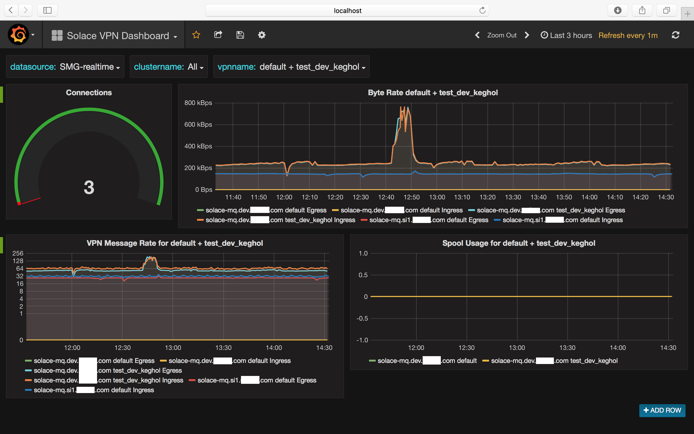

# Solace Metrics Gatherer

## Description

The SMG is a configurable metrics gathering service, built ontop of vertx.io , which can 
query Solace Routers for metrics, and persist those metrics to InfluxDB. 

SMG can be configured to query just about anything in the Solace appliance, and uses Xpath to 
traverse the response data.

The SMG has 2 deployable vertx.io verticles.

The SMGApp verticle, connects to Solace, and requests metrics asynchronously,  converting the
responses to JSON, and publishes the metrics on Topics for the InfluxClient.

The InfluxClient verticle consumes the JSON metrics produced by SMGApp,  and persists them to
InfluxDB using the influx java http client.




## Licensing and Commercial Usage

Usage of SMG is subject to a $1000 yearly fee. Its a honour based system, please contact me
on smg@kegans.com for more info.

Subscribers also get access to the source code.

## QuickStart

Get the current [binary](https://github.com/unixunion/solace-metrics-to-influxdb/releases/download/v1.0-beta1/solace-metrics-gatherer-fat.jar) or build with  `./gradlew shadowJar`
* Enable "Management VPN" and "SHOW SEMP" on a VPN per cluster
* Create a client-user for the SMGApp and InfluxClient in the VPN
* Create a config based off `config/ENV_NAME/influxclient.json`
* Create a config based off `config/ENV_NAME/smgapp.json`

```
export JAVA_OPTS="-Dvertx.logger-delegate-factory-class-name=io.vertx.core.logging.SLF4JLogDelegateFactory"
java $JAVA_OPTS -jar solace-metrics-gatherer-fat.jar -conf configure config/ENV_NAME/influxclient.json
java $JAVA_OPTS -jar solace-metrics-gatherer-fat.jar -conf configure config/ENV_NAME/smgapp.json
```

## Deployment and Configuring

It is recommended to deploy the SMG across two JVM's, deploy a instance of `SMGApp` in 
one VM, and, in another, the `InfluxClient`. Repeat per "cluster" the SMG is to monitor.

For the above described split deployments, see `config/dev/influxclient.json` and `config/dev/smgapp.json`

SMG requires that the Solace connection be to a `Management VPN` with `SEMP SHOW` enabled. Please consult the Solace documentation for more info.

### InfluxDB

You need InfluxDB to persist metrics to. Ensure reasonable retention policies and continuous 
queries setup to downsample data as needed.

#### Data Retention

Remember to tweak your retention policy in influxdb to be something reasonable.
and see https://docs.influxdata.com/influxdb/v1.1/guides/downsampling_and_retention/

The following is 14 days at full res, then down to 30 minutes for a year, and
2h resolution up to 5 years.

```
CREATE DATABASE smg;
CREATE DATABASE smg_downsampled;

CREATE RETENTION POLICY "default" ON "smg" DURATION 1d REPLICATION 1 DEFAULT
CREATE RETENTION POLICY "default" ON "smg_downsampled" DURATION 52w REPLICATION 1 DEFAULT
CREATE RETENTION POLICY "5_year" ON "smg_downsampled" DURATION 312w REPLICATION 1

USE "smg"

CREATE CONTINUOUS QUERY "cq_1year_data" ON "smg"
BEGIN
  SELECT mean(*) INTO "smg_downsampled"."default".:MEASUREMENT FROM /.*/ GROUP BY time(30m),*
END

CREATE CONTINUOUS QUERY "cq_5year_data" ON "smg"
BEGIN
  SELECT mean(*) INTO "smg_downsampled"."5_year".:MEASUREMENT FROM /.*/ GROUP BY time(2h),*
END

```

### SMGApp Configuring

Solace connection and metric requests are defined in the SMGApp config json, for example:

```JSON
{
  "conf_source": "tld",
  "services": {
    "DEV": {
      "class": "com.deblox.smg.SMGApp",
      "config": {
        "environment": "dev",
        "cluster_name": "solace-mq.dev.domain.com",
        "solace_address": "10.10.10.10:55555",
        "solace_vpn": "default",
        "solace_user": "smg",
        "solace_pass": "password",
        "semp_rpc_version": "7_1_1",
        "publish_top  ic_prefix": "#SMG",
        "request_credits": 2000,
        "request_queue_check_interval": 25,
        "blocking_mode": false,
        "requestResponseHandlers": [
          {
            "class": "com.deblox.smg.data.handlers.FlexibleHandler",
            "XML": "<rpc semp-version='soltr/%s'><show><message-spool><stats></stats></message-spool></show></rpc>",
            "xpath_config": {
              "debug": false,
              "xpath_expression": "//show/message-spool/message-spool-stats",
              "xpath_subkey": ".",
              "xpath_descend_into": [],
              "tags": {},
              "metric-type": "message-spool-stats"
            }
          },
          //...
          //...
          //...
```

More info on the config below.

#### Request Response Handlers

Request response handlers are deployed by class name, to perform metric requests.
Each one is instantiated with its own configuration, and periodically triggered by
the event-loop.

##### Class

This is the class name of the handler which to deploy, and pass the config
into. There is currently only one, the `FlexibleHandler`. 

FlexibleHandler supports iterating over a list of objects. A subkey specified 
the key on the object which contains the list of keys/values to extract. The 
FlexibleHandler also supports descending into additional direct children of 
each object to gather metrics. 

##### XML

This is the SEMP request that will be sent to the appliance, the %s will
be substituted with the detected appliance version. Pay special heed to the 
num-elements attribute, this is the number of objects per page back from
the appliance. 10 is a safe value here, larger numbers can exceed the 
limitations on the SEMP protocol.

##### xpath_config

Values of interest are extracted from SEMP responses using XPath. 
The `xpath_expression` is the path to a iterable list of response objects. 
 
e.g:
```
<something>
    <alist>
        <item>
            <stats>
                <foo>bar</foo>
                <baz>jaz</baz>
                <deeper>
                    <a>12</a>
                    <b>123</b>
                </deeper>
            </stats>
        </item>
        <item><stats>...</stats></item>
        <item><stats>...</stats></item>
        <item><stats>...</stats></item>
    <alist>
</something>
```

The `xpath_expression` for the above XML would be `//something/alist`. And 
that path, would return a list of `item` objects.

The key `xpath_subkey` maps to the subnode, which contains the keys/values
to be extracted into metrics. In the above example the `xpath_subkey` 
would be `stats`.

The `xpath_descend_into` directive will descend into additional children of
the `xpath_subkey`, and will concatenate the name of the subkey, and the
put the values therein. In the above example, adding a xpath_subkey:
`deeper` would result in metrics created with the name `deeper-a` and 
`deeper-b`.

Tags are the mapping of values in the current object, or its imediate 
parent to tag names. Some tags are automatically added, like the 
"environment" and "cluster-name" as defined in in the solace properties 
section of the config.

If `transform_regex` is defined on a tag, values will have it applied 
before being sent to Influx. The regex "^(.*?)\\/" converts client 
names from a format "myhost.mydomain.com/3213/123123/321" to just the 
FQDN portion of the name. Since creating unique tags is not what tags 
are for.

`metric-type` will be the name of the "measurement" in influxdb.


## Running

A instance of the application needs to run for each "cluster" it monitors.

### JAR

```
java -Dvertx.logger-delegate-factory-class-name=io.vertx.core.logging.SLF4JLogDelegateFactory -jar /usr/smg/solace-metrics-gatherer-fat.jar -conf /usr/smg/config/si1/conf.json
```

### Performance

Optimal performance is achieved by deploying the InfluxClient and SMGApp into separate JVM's through the "services" directive in config. 

see config/dev for example of splitting services.
