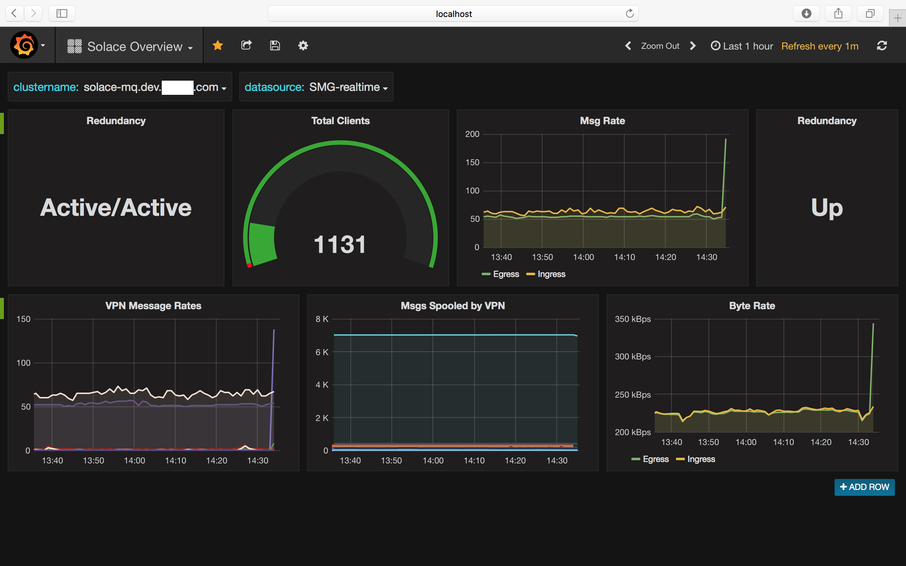

# Solace Metrics Gatherer

## Description

The SMG is a configurable metrics gathering service, built ontop of vertx.io , which can 
query Solace Routers for metrics, and persist those metrics to InfluxDB. 

SMG can be configured to query just about anything in the Solace appliance, and uses Xpath to 
traverse the response data.

The SMG has 2 deployable vertx.io verticles.

The SMGApp verticle, connects to Solace, and requests metrics asynchronously,  converting the
responses to JSON, and publishes the metrics on Topics for the InfluxClient.

The InfluxClient verticle consumes the JSON metrics produced by SMGApp,  and persists them to
InfluxDB using the influx java http client.




## Licensing and Commercial Usage

Usage of SMG is subject to a $1000 yearly fee. Its a honour based system, please contact me
on smg@kegans.com for more info.

## QuickStart

Get the current [binary](https://github.com/unixunion/solace-metrics-gatherer/releases/download/v1.0/solace-metrics-gatherer-fat.jar) or build with  `./gradlew shadowJar`
* Enable "Management VPN" and "SHOW SEMP" on a VPN per cluster
* Create a client-user for the SMGApp and InfluxClient in the VPN
* Create a config based off `config/ENV_NAME/influxclient.json`
* Create a config based off `config/ENV_NAME/smgapp.json`

```
export JAVA_OPTS="-Dvertx.logger-delegate-factory-class-name=io.vertx.core.logging.SLF4JLogDelegateFactory"
java $JAVA_OPTS -jar solace-metrics-gatherer-fat.jar -conf configure config/ENV_NAME/influxclient.json
java $JAVA_OPTS -jar solace-metrics-gatherer-fat.jar -conf configure config/ENV_NAME/smgapp.json
```

## Deployment and Configuring

It is recommended to deploy the SMG across two JVM's, deploy a instance of `SMGApp` in 
one VM, and, in another, the `InfluxClient`. Repeat per "cluster" the SMG is to monitor.

For the above described split deployments, see `config/dev/influxclient.json` and `config/dev/smgapp.json`

SMG requires that the Solace connection be to a `Management VPN` with `SEMP SHOW` enabled. Please consult the Solace documentation for more info.

### InfluxDB

You need InfluxDB to persist metrics to. Ensure reasonable retention policies and continuous 
queries setup to downsample data as needed.

#### Data Retention

Remember to tweak your retention policy in influxdb to be something reasonable.
and see https://docs.influxdata.com/influxdb/v1.1/guides/downsampling_and_retention/

The following is 14 days at full res, then down to 30 minuts for a year, and
2h resolution up to 5 years.

```
CREATE DATABASE smg;
CREATE DATABASE smg_downsampled;

CREATE RETENTION POLICY "default" ON "smg" DURATION 1d REPLICATION 1 DEFAULT
CREATE RETENTION POLICY "default" ON "smg_downsampled" DURATION 52w REPLICATION 1 DEFAULT
CREATE RETENTION POLICY "5_year" ON "smg_downsampled" DURATION 312w REPLICATION 1

USE "smg"

CREATE CONTINUOUS QUERY "cq_1year_data" ON "smg"
BEGIN
  SELECT mean(*) INTO "smg_downsampled"."default".:MEASUREMENT FROM /.*/ GROUP BY time(30m),*
END

CREATE CONTINUOUS QUERY "cq_5year_data" ON "smg"
BEGIN
  SELECT mean(*) INTO "smg_downsampled"."5_year".:MEASUREMENT FROM /.*/ GROUP BY time(2h),*
END

```


### SMGApp Configuring

Solace connection and metric requests are defined in the SMGApp config json, for example:

```JSON
{
  "conf_source": "tld",
  "services": {
    "DEV": {
      "class": "com.deblox.smg.SMGApp",
      "config": {
        "environment": "dev",
        "cluster_name": "solace-mq.dev.domain.com",
        "solace_address": "10.10.10.10:55555",
        "solace_vpn": "default",
        "solace_user": "smg",
        "solace_pass": "password",
        "semp_rpc_version": "7_1_1",
        "publish_top  ic_prefix": "#SMG",
        "request_credits": 2000,
        "request_queue_check_interval": 25,
        "blocking_mode": false,
        "requestResponseHandlers": [
          {
            "class": "com.deblox.smg.data.handlers.FlexibleHandler",
            "XML": "<rpc semp-version='soltr/%s'><show><message-spool><stats></stats></message-spool></show></rpc>",
            "xpath_config": {
              "debug": false,
              "xpath_expression": "//show/message-spool/message-spool-stats",
              "xpath_subkey": ".",
              "xpath_descend_into": [],
              "tags": {},
              "metric-type": "message-spool-stats"
            }
          },
          //...
          //...
          //...
```

More info on the config below below.

#### Request Response Handlers

Request response handlers are deployed by class name, to perform metric requests.
Each one is instantiated with its own configuration, and periodically triggered by
the event-loop.

##### Class

This is the class name of the handler which to deploy, and pass the config
into. There is currently only one, the `FlexibleHandler`. 

FlexibleHandler supports iterating over a list of objects. A subkey specified 
the key on the object which contains the list of keys/values to extract. The 
FlexibleHandler also supports descending into additional direct children of 
each object to gather metrics. 

##### XML

This is the SEMP request that will be sent to the appliance, the %s will
be substituted with the detected appliance version. Pay special heed to the 
num-elements attribute, this is the number of objects per page back from
the appliance. 10 is a safe value here, larger numbers can exceed the 
limitations on the SEMP protocol.

##### xpath_config

Values of interest are extracted from SEMP responses using XPath. 
The `xpath_expression` is the path to a iterable list of response objects. 
 
e.g:
```
<something>
    <alist>
        <item>
            <stats>
                <foo>bar</foo>
                <baz>jaz</baz>
                <deeper>
                    <a>12</a>
                    <b>123</b>
                </deeper>
            </stats>
        </item>
        <item><stats>...</stats></item>
        <item><stats>...</stats></item>
        <item><stats>...</stats></item>
    <alist>
</something>
```

The `xpath_expression` for the above XML would be `//something/alist`. And 
that path, would return a list of `item` objects.

The key `xpath_subkey` maps to the subnode, which contains the keys/values
to be extracted into metrics. In the above example the `xpath_subkey` 
would be `stats`.

The `xpath_descend_into` directive will descend into additional children of
the `xpath_subkey`, and will concatenate the name of the subkey, and the
put the values therein. In the above example, adding a xpath_subkey:
`deeper` would result in metrics created with the name `deeper-a` and 
`deeper-b`.

Tags are the mapping of values in the current object, or its imediate 
parent to tag names. Some tags are automatically added, like the 
"environment" and "cluster-name" as defined in in the solace properties 
section of the config.

If `transform_regex` is defined on a tag, values will have it applied 
before being sent to Influx. The regex "^(.*?)\\/" converts client 
names from a format "myhost.mydomain.com/3213/123123/321" to just the 
FQDN portion of the name. Since creating unique tags is not what tags 
are for.

`metric-type` will be the name of the "measurement" in influxdb.


## Running

A instance of the application needs to run for each "cluster" it monitors.

### JAR

```
java -Dvertx.logger-delegate-factory-class-name=io.vertx.core.logging.SLF4JLogDelegateFactory -jar /usr/smg/solace-metrics-gatherer-fat.jar -conf /usr/smg/config/si1/conf.json
```

### Docker Compose with InfluxDB and Grafana

See the `docker-compose.yml` for how multiple instances are launched to
multiple environments, sharing a influxdb and grafana.

```
sh build-containers.sh
docker-compose up --abort-on-container-exit
```

#### Docker Stack Configs

InfluxDB: influxdb.conf
InfluxDB Persistence: influx-data/
SMG environments, see config/


### Performance

Optimal performance is achieved by deploying the InfluxClient and SMGApp
into separate JVM's through the "services" directive in config. 

see config/dev for example of splitting services.

# Development

## SMGApp Verticle

This verticle is responsible for requesting metrics via SEMP-over-MSGBUS 
at defined intervals. The actual request and its subsequent response is 
done through implementations of the AbstractSMGHandler class.


## AbstractSMGHandler

These handlers are responsible for interpretting the XML response from the
appliances, and setting various key values in the metric, such as metric
 name, type and tags, along with the actual metrics.

XPath is used, and all the sub-classes are almost identical copies 
of each other, as I am workin towards a completely configuration defined
xpath and tagging flow.

## InfluxDBClient Verticle

This verticle connects and subscribe to the SMGApp topic(s) for metrics. 
Metrics are expected to have the following format:

```json
{
   "measurement-name":{
      "name": "some string",
      "in":1024,
      "out":2048,
      "sideways":4096,
      "a_boolean", "false"
   },
   "tags":{
      "environment":"prod1",
      "host":"localhost",
      "name":"disk",
      "type":"io",
      "foo": "bar
   },
   "timestamp":1473238912131 // optional, else uses server time
}
```


## SMGApp Handlers

Handlers are extended from AbstractHandler which provides a standard 
constructor for the handlers, and a schedule_request method which. A 
Handler must send a request for metrics to the Solace SEMP Topic, and 
handle the responses back from the appliance.

There is no reason why handlers could not request metrics direct from 
products also if they were configured to do so.

# Development

## IntelliJ Idea

To generate the idea files

```sh
./gradlew idea
```

## Testing

```sh
./gradlew test -i
```

## Running from Idea
the Boot.java class can be run directly and accepts `-conf` argument for 
specifying the config json.


## Building fatJar

The gradle task *shadowJar* will build a executable jar.

```
./gradlew shadowJar
```

## Uploading to nexus

```
./gradlew -Dmaven.wagon.http.ssl.insecure=true -Dmaven.wagon.http.ssl.allowall=true uploadArchives 
```

## Running

When running as a fatJar, remember to specify the alternate logging 
implementation.

```
JAVA_OPTS="-Dvertx.logger-delegate-factory-class-name=io.vertx.core.logging.SLF4JLogDelegateFactory"
java $JAVA_OPTS -jar build/libs/solace-metrics-gatherer-1.0.0-SNAPSHOT-fat.jar -conf conf.json
```

## Docker ( Currently Broken, docker repo's on the fritz )

Docker is used for local development, configuration is loaded
based on a "ENV" variable which defaults to "dev". There is a separate
config for composing a cicd environment comprising of the smg and influxdb.

### Testing via Compose

See Dockerfile.integrationtest, and a docker-compose.yml which do the
legwork.

```
# local compose
docker-compose up --build --abort-on-container-exit

OR

# containered compose
docker run -v `pwd`:/usr/src \
           -v ~/.docker:/root/.docker \
           -v /var/run/docker.sock:/var/run/docker.sock \
           docker.aws.domain.com:18079/domain/builder:latest \
           docker-compose up --build --abort-on-container-exit
```


### Build a Docker Image

#### Building using the domain Build Container ( UBC )

```
# docker login docker.aws.domain.com:18079 and/or setup docker for insecure registry
docker pull docker.aws.domain.com:18079/domain/builder:latest
docker run -e COMPONENT_NAME=solace-metrics-gatherer \
           -e COMPONENT_VERSION=0.1.20 \
           -e COMPONENT_ENVIRONMENT=cicd \
           -v `pwd`:/usr/src \
           -v ~/.docker:/root/.docker \
           -v /var/run/docker.sock:/var/run/docker.sock \
           docker.aws.domain.com:18079/domain/builder:latest

```

#### Running the container

```
docker pull docker.aws.domain.com:18079/amo/solace-metrics-gatherer:latest
docker run -e ENV=dev docker.aws.domain.com:18079/amo/solace-metrics-gatherer:latest
```


### Building a Container from the local compile

```
docker build -t amo/smg:0.0.3 .
```

### Tag and Upload

docker tag e10ec90ca085 docker.aws.domain.com:18079/amo/smg:0.0.3
docker push docker.aws.domain.com:18079/amo/smg:0.0.3

## Latest a hash

docker tag e10ec90ca085 docker.aws.domain.com:18079/amo/smg:latest
docker push docker.aws.domain.com:18079/amo/smg:latest

### Run a Image
docker run v /tmp/secrets:/secrets -e ENV=dev domain/smg:0.0.3

## Testing / Running Locally

##### start influx
docker run -p 8083:8083 -p 8086:8086 influxdb

##### start grafana
docker run -p 3000:3000 -p 8086:8086 grafana/grafana

Configure the datasource in grafana

##### start the consumer
./gradlew shadowJar # if you havnt already built it.
java -jar build/libs/solace-metrics-gatherer-fat.jar -conf conf-influx.json

##### start the publisher
java -jar build/libs/solace-metrics-gatherer-fat.jar -conf conf.json

### Spin up, test and destroy
./gradlew test -i

#### Run a full stack in Docker Compose

```
sh build-containers.sh
docker-compose up --abort-on-container-exit
```

Browse to http://localhost:3000 after a minute or two, then add InfluxDB 
Datasource http://localhost:8086 db name smg. and "direct" mode.

### Recomposing only the SMG, keeping influx and grafana

After running sh build-containers.sh

```
docker rm solacemetricsgatherer_smg-si1_1
docker rm solacemetricsgatherer_smg-dev_1
docker-compose up --abort-on-container-exit
```
